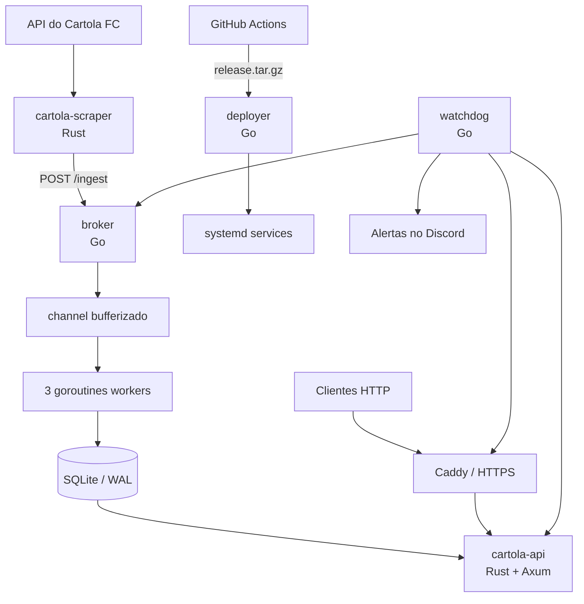

# VM-PM — Megazord

Arquitetura enxuta de serviços para coleta, processamento e consulta de dados do Cartola FC, projetada para operar em uma VM Linux com recursos limitados.

O projeto combina **Go** nos serviços operacionais — ingestão, deploy e monitoramento — com **Rust** na API e no coletor de dados. A persistência usa SQLite, e o pipeline do GitHub Actions gera binários Linux e realiza o deploy automaticamente.

## Visão geral



## Objetivos do projeto

- Executar vários serviços em uma VM com baixo consumo de memória.
- Separar coleta, ingestão, leitura, deploy e observabilidade.
- Processar payloads de forma assíncrona com goroutines e channels.
- Automatizar build e publicação de binários.
- Manter os serviços internos acessíveis apenas localmente sempre que possível.
- Experimentar uma rede privada com WireGuard para acesso por celular, notebook e desktop.

> A configuração do WireGuard pertence à infraestrutura da VM e não está versionada neste repositório. A proposta é utilizar a VM como gateway/exit node e permitir acesso privado aos serviços por um túnel criptografado.

## Componentes

| Componente | Tecnologia | Responsabilidade | Porta padrão |
|---|---|---|---:|
| `cartola-scraper` | Rust, Tokio e Reqwest | Consulta a API do Cartola, normaliza atletas e clubes e envia o payload ao broker | — |
| `broker` | Go 1.22 e SQLite | Recebe payloads, aplica backpressure, distribui o trabalho e persiste os dados | 8081 |
| `cartola-api` | Rust, Axum e Rusqlite | Expõe consultas de atletas e cálculo de tendência | 8080 |
| `deployer` | Go 1.22 | Recebe releases autenticadas, instala binários e reinicia serviços | 8084 |
| `watchdog` | Go 1.22 | Monitora health checks e envia alertas ao Discord | 8083 |
| `Caddy` | Reverse proxy | Publicação HTTPS do serviço autorizado | 443 |

## Destaques em Go

### Broker assíncrono

O broker possui uma fila em memória representada por um `chan Payload` com buffer de 100 itens. Três goroutines consomem essa fila e persistem os dados:

```go
type Broker struct {
    db    *sql.DB
    queue chan Payload
}

func NewBroker(db *sql.DB) *Broker {
    broker := &Broker{
        db:    db,
        queue: make(chan Payload, 100),
    }

    for id := 0; id < 3; id++ {
        go broker.worker(id)
    }

    return broker
}
```

O endpoint de ingestão retorna:

- `202 Accepted` quando o payload entra na fila;
- `400 Bad Request` para JSON inválido;
- `405 Method Not Allowed` para métodos incorretos;
- `503 Service Unavailable` quando a fila está cheia.

Esse comportamento evita crescimento ilimitado da fila e aplica **backpressure** quando o serviço está sobrecarregado.

### Persistência transacional

A escrita de clubes e atletas acontece em uma transação SQLite. O broker utiliza prepared statements e `ON CONFLICT ... DO UPDATE` para realizar upserts. Em caso de falha, a transação sofre rollback; caso contrário, é confirmada com commit.

O SQLite é aberto com journal em modo WAL e uma única conexão de escrita, reduzindo contenção no ambiente limitado da VM.

### Deployer

O serviço de deploy:

1. autentica a requisição com Bearer Token;
2. limita o upload a 150 MB;
3. responde `202 Accepted` e continua o deploy em background;
4. extrai o pacote em um diretório temporário;
5. instala cada binário primeiro como arquivo `.new`;
6. utiliza `os.Rename` para realizar a troca atômica;
7. reinicia os serviços com `systemctl`.

Durante a extração, `filepath.Base` é utilizado para evitar directory traversal.

### Watchdog

O watchdog usa `time.Ticker` para verificar periodicamente:

- API;
- broker;
- proxy HTTPS.

Mudanças de estado geram logs estruturados e notificações por webhook no Discord. O próprio watchdog também expõe seu health check.

## Fluxo de dados

1. O scraper consulta `https://api.cartola.globo.com/atletas/mercado`.
2. Os dados são normalizados para o modelo interno.
3. O scraper envia o payload para `POST /ingest`.
4. O broker coloca o payload no channel.
5. Uma das goroutines processa o item da fila.
6. Clubes e atletas são atualizados dentro de uma transação.
7. A API consulta o mesmo banco e entrega os dados ao cliente.

## API

### Cartola API

| Método | Rota | Descrição |
|---|---|---|
| `GET` | `/health` | Estado do serviço, versão e rodada atual |
| `GET` | `/atletas` | Lista atletas, com filtros e limite |
| `GET` | `/atletas/:id` | Exibe um atleta e sua tendência recente |

Parâmetros disponíveis em `GET /atletas`:

- `posicao`;
- `clube_id`;
- `limite` — máximo de 200 registros.

### Broker

| Método | Rota | Descrição |
|---|---|---|
| `POST` | `/ingest` | Recebe clubes e atletas para processamento |
| `GET` | `/health` | Exibe fila pendente e quantidade de atletas |

### Serviços operacionais

| Serviço | Método | Rota | Descrição |
|---|---|---|---|
| Deployer | `POST` | `/deploy` | Recebe um `release.tar.gz` autenticado |
| Deployer | `GET` | `/health` | Health check |
| Watchdog | `GET` | `/health` | Health check |

## Estrutura

```text
VM-PM/
├── .github/workflows/build.yml
├── broker/
│   ├── go.mod
│   └── main.go
├── cartola-api/
│   ├── Cargo.toml
│   └── src/main.rs
├── cartola-scraper/
│   ├── Cargo.toml
│   └── src/main.rs
├── deployer/
│   ├── go.mod
│   └── main.go
├── migrations/
│   └── 001_initial.sql
├── watchdog/
│   ├── go.mod
│   └── main.go
├── Cargo.toml
└── Cargo.lock
```

## Variáveis de ambiente

| Variável | Serviço | Padrão/finalidade |
|---|---|---|
| `DB_PATH` | Broker e API | `/var/lib/megazord/cartola.db` |
| `PORT` | Broker, API e Deployer | Porta do respectivo serviço |
| `BROKER_URL` | Scraper | `http://127.0.0.1:8081/ingest` |
| `DEPLOY_TOKEN` | Deployer | Token obrigatório para publicar releases |
| `DISCORD_WEBHOOK` | Watchdog | Canal de alertas operacionais |
| `CHECK_INTERVAL` | Watchdog | Intervalo das verificações em segundos |
| `RUST_LOG` | API e Scraper | Nível/filtro dos logs Rust |

No GitHub Actions também são necessários os secrets:

- `DEPLOY_TOKEN`;
- `VM_DOMAIN`.

## Build local

### Serviços Go

```bash
cd broker && go build -o broker .
cd ../deployer && go build -o deployer .
cd ../watchdog && go build -o watchdog .
```

O broker utiliza `go-sqlite3` e, portanto, precisa de CGO e um compilador C disponível.

### Serviços Rust

```bash
cargo build --release --workspace
```

## CI/CD

A cada push na branch `main`, o workflow:

1. compila `cartola-api` e `cartola-scraper` como binários Linux estáticos;
2. compila `broker`, `deployer` e `watchdog`;
3. publica os binários como artifacts;
4. reúne os arquivos em `release.tar.gz`;
5. envia a release ao deployer por HTTPS.

O pipeline atual gera binários para **Linux x86-64/AMD64**.

## Decisões de segurança

- serviços operacionais escutam em `127.0.0.1`;
- endpoint de deploy protegido por Bearer Token;
- limite de tamanho para releases;
- instalação atômica de binários;
- proteção básica contra directory traversal;
- secrets mantidos fora do código;
- rede WireGuard planejada/configurada externamente para acesso privado;
- exposição pública centralizada no reverse proxy.

## Stack

- Go 1.22
- Rust 2021
- Tokio
- Axum
- Reqwest
- SQLite / WAL
- GitHub Actions
- Linux / systemd
- Caddy
- DuckDNS
- WireGuard na infraestrutura

## Status

Projeto experimental e de portfólio voltado ao estudo de backend, concorrência, observabilidade, automação de deploy e operação de serviços em infraestrutura com recursos limitados.

---

Desenvolvido por [Eduardo Taino](https://github.com/Taino-Edu).
